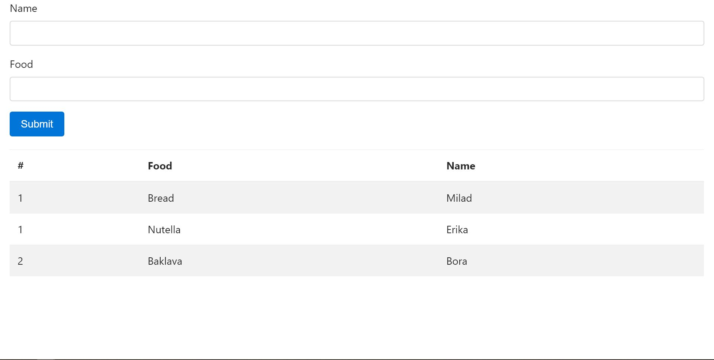

# Party Food
- Create an express application that can output data from an Object Array as a table
- The app should have one view, which also includes a form to add new items to the list
- The user should be able to submit the form and see the new item in the list

